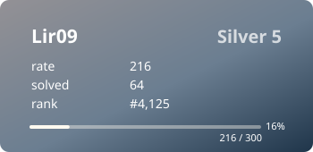

# JUNGOL Profile Card

GitHub README에서 사용할 수 있는 JUNGOL 프로필 카드입니다.  
현재 기본 카드는 [`Lir09`](https://jungol.co.kr/account/143157)의 **티어, RV, 푼 문제 수, 랭킹**을 읽어 자동으로 갱신합니다.

## Current card

[](https://jungol.co.kr/account/143157)

## 사용 방법

### 1. 바로 사용하기

아래 Markdown을 원하는 GitHub `README.md`에 그대로 붙여 넣으면 됩니다.

```md
[](https://jungol.co.kr/account/143157)
```

`jungol-card.svg`는 기본 **v2 Animated** 디자인입니다.

### 2. 디자인 선택하기

#### v2 · Animated

```md
[](https://jungol.co.kr/account/143157)
```

#### v1 · Classic

```md
[](https://jungol.co.kr/account/143157)
```

#### Compact

```md
[](https://jungol.co.kr/account/143157)
```

### 3. 내 JUNGOL 계정으로 사용하기

이 저장소를 Fork한 뒤 아래 값만 자신의 계정에 맞게 바꾸면 됩니다.

1. `generate_card.py`의 `ACCOUNT_ID`를 자신의 JUNGOL 계정 ID로 변경합니다.
2. `main()` 안의 `Lir09` 계정 확인 부분을 자신의 JUNGOL 핸들로 변경합니다.
3. 변경 내용을 `main` 브랜치에 Push합니다.
4. GitHub Actions의 **Update JUNGOL Cards**가 실행되면 `jungol-card.svg`와 디자인 파일이 생성됩니다.
5. 자신의 GitHub 아이디를 넣은 Raw URL을 README에 사용합니다.

예시:

```md
[](https://jungol.co.kr/account/<account-id>)
```

GitHub Actions 탭에서 `Update JUNGOL Cards`를 수동 실행할 수도 있습니다.

## 표시되는 정보

- JUNGOL 핸들
- 현재 티어
- RV
- 푼 문제 수
- 전체 랭킹
- 다음 티어까지의 진행률

## Tier Gallery · v2

아래는 **Bronze V부터 Ruby I까지 모든 티어의 v2 디자인 미리보기**입니다.  
`Preview / rate / solved / rank` 값은 디자인 확인용 샘플이며, 실제 `jungol-card.svg`는 JUNGOL 계정 데이터를 사용합니다.

### Bronze

| Bronze V | Bronze IV |
| --- | --- |
|  |  |

| Bronze III | Bronze II |
| --- | --- |
|  |  |

| Bronze I |
| --- |
|  |

### Silver

| Silver V | Silver IV |
| --- | --- |
|  |  |

| Silver III | Silver II |
| --- | --- |
|  |  |

| Silver I |
| --- |
|  |

### Gold

| Gold V | Gold IV |
| --- | --- |
|  |  |

| Gold III | Gold II |
| --- | --- |
|  |  |

| Gold I |
| --- |
|  |

### Platinum

| Platinum V | Platinum IV |
| --- | --- |
|  |  |

| Platinum III | Platinum II |
| --- | --- |
|  |  |

| Platinum I |
| --- |
|  |

### Diamond

| Diamond V | Diamond IV |
| --- | --- |
|  |  |

| Diamond III | Diamond II |
| --- | --- |
|  |  |

| Diamond I |
| --- |
|  |

### Ruby

| Ruby V | Ruby IV |
| --- | --- |
|  |  |

| Ruby III | Ruby II |
| --- | --- |
|  |  |

| Ruby I |
| --- |
|  |

## Designs

### v2 · Animated (default)

`mazassumnida` v2의 레이아웃과 애니메이션 감성을 참고해 JUNGOL용으로 재구성한 기본 디자인입니다.

[](https://jungol.co.kr/account/143157)

### v1 · Classic

애니메이션 없이 정보가 바로 보이는 심플한 카드입니다.

[](https://jungol.co.kr/account/143157)

### Compact

README나 프로젝트 목록에 작게 넣기 위한 한 줄 버전입니다.

[](https://jungol.co.kr/account/143157)

## Auto update

GitHub Actions가 JUNGOL 공개 프로필을 읽어서 현재 카드와 디자인 파일을 자동 갱신합니다. 티어 갤러리 30종도 생성 스크립트로 함께 관리합니다.

현재는 **6시간마다 자동 실행**되며 Actions 탭에서 수동 실행도 가능합니다. 값이 바뀌지 않았다면 불필요한 카드 업데이트 커밋을 만들지 않습니다.

> GitHub README 이미지에는 캐시가 적용될 수 있어 JUNGOL 정보가 갱신된 직후에는 화면에 반영되기까지 약간의 시간이 걸릴 수 있습니다.

## Design reference

v2는 [`mazassumnida/mazassumnida`](https://github.com/mazassumnida/mazassumnida)의 v2 badge에서 레이아웃과 애니메이션 방향을 참고해 JUNGOL 데이터 구조에 맞게 다시 구현했습니다.
